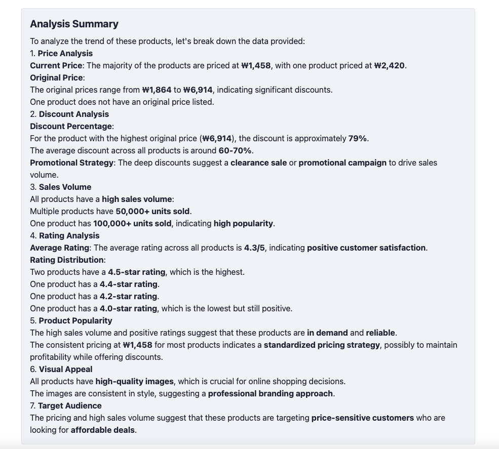

# E-Commerce Scraper

## Project Overview
This project is a web-based e-commerce scraper that fetches product data from a given URL and displays the results in a structured table. Additionally, it generates a summarized analysis of the product trends using Markdown formatting.

## Features
- Fetches product data from an API.
- Displays products in a table with price, original price, title, rating, and product image.
- Provides a paginated view for navigating through multiple pages.
- Renders a formatted summary using Markdown.

## Technologies Used
- **React** (Frontend framework)
- **Tailwind CSS** (For styling)
- **React Markdown** (To render summary text in Markdown format)

## Installation

### 1. Clone the repository
```bash
git clone https://github.com/widiasamosir/scraper-web.git
cd scraper-web
```

### 2. Install dependencies
```bash
npm install
```

### 3. Run the development server
```bash
npm run dev
```

## Usage
1. Open your browser and navigate to `http://localhost:5173/`.
2. Enter the Ali Express URL for scraping  and (Optional) What you want to analyze with those data and click search.
```bash
https://www.aliexpress.com/ssr/300000556/zQFHEaEPNJ?spm=a2g0o.home.tab.2.650c76dbd2i9HW&disableNav=YES&pha_manifest=ssr&_immersiveMode=true
```




3. View the scraped product data in the table.
4. Navigate through pages using the pagination buttons.
5. Read the product trend summary displayed below the table.

## API Endpoint
The application fetches data from:
```bash
http://localhost:3000/scrape-ai?limit=5&page=1&url={url}&summarize={summarizeText}
```

## Dependencies
- `react`
- `tailwindcss`
- `react-markdown`
